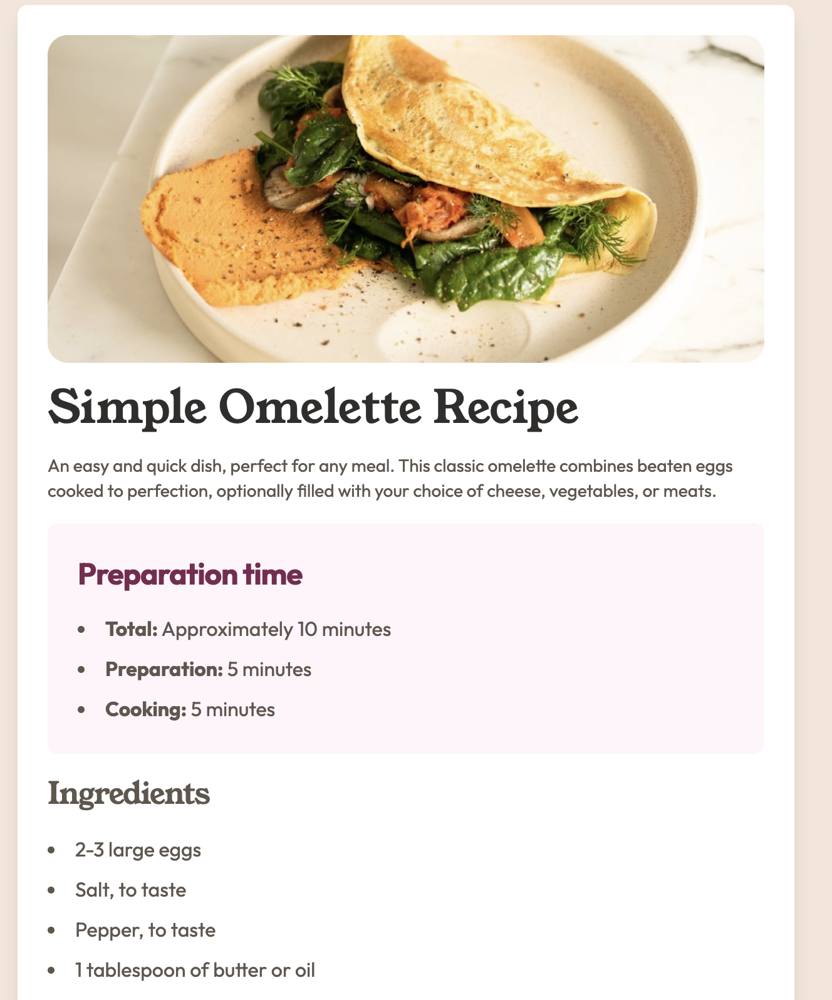

# Frontend Mentor - Recipe page solution

This is a solution to the [Recipe page challenge on Frontend Mentor](https://www.frontendmentor.io/challenges/recipe-page-KiTsR8QQKm). Frontend Mentor challenges help you improve your coding skills by building realistic projects.

## Table of contents

- [Overview](#overview)
  - [The challenge](#the-challenge)
  - [Screenshot](#screenshot)
  - [Links](#links)
- [My process](#my-process)
  - [Built with](#built-with)
  - [What I learned](#what-i-learned)
- [Author](#author)

## Overview

### Screenshot



### Links

- [Solution Page](https://github.com/okutewonah/fm-recipe-page)
- [Live View](https://okutewonah.github.io/fm-recipe-page/)

## My process

### Built with

- Semantic HTML5 markup
- Tailwind CSS
- Flexbox
- Mobile-first workflow

### What I learned

I learnt that I can adjust the gap in a list between the number/bullet and the item.

```css
ol > li {
  position: relative;
  counter-increment: list-counter;
  padding-left: 2.5rem;
  list-style: none;
}
ol > li::before {
  content: counter(list-counter) ".";
  position: absolute;
  left: 0;
  top: 0;
  font-weight: bold;
}
```

## Author

- Frontend Mentor - [@okutewonah](https://www.frontendmentor.io/profile/okutewonah)
- GitHub - [@okutewonah](https://github.com/okutewonah)
